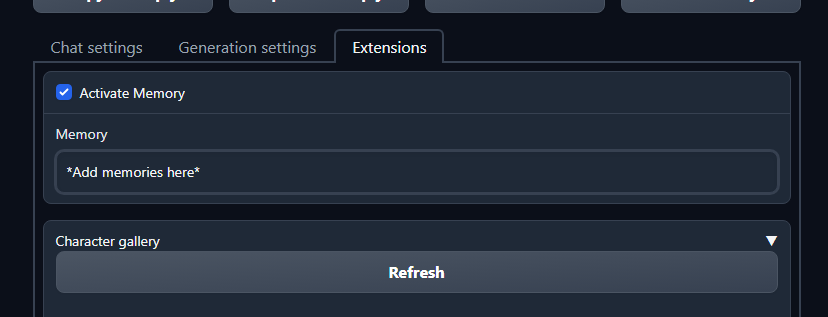

# simple_memory


# How to install

Open a cmd window in your `extensions` folder.

`git clone https://github.com/theubie/simple_memory`

Add the following flag to your start script: `--extension simple_memory`

OR

Download the ZIP from the green `code` button on the top right, extract that folder to `text-generation-webui/extensions`, rename the folder to `simple_memory`, and add `--extension simple_memory` to your start script.

# What does it do?

The memory adds whatever is in the box to the start of the prompt.  

It is part of your token limit.  

The settings for the extension are saved between sessions.

# How to use
Check the `Active Memory` checkbox and the text in the `Memory` box will be placed *before* the entire conversation. It will provide information to the conversation *outside of the messages*.

**If you alter the contents of the `Memory` box during a conversation, the top of the conversation will be altered.**

**Here is an example**: 

Before the first message, we input "we like pizza" in the `Memory` box. Before the second message, we input "we do not like pizza" in the `Memory` box.

```
we like pizza
This is a conversation between two people.
Person 1: hello
Person 2: I'm hungry, let's get some pizza!
Person 1: how are you?
Person 2:
--------------------

Output generated in 2.03 seconds (5.41 tokens/s, 11 tokens)

we do not like pizza
This is a conversation between two people.
Person 1: hello
Person 2: I'm hungry, let's get some pizza!
Person 1: how are you?
Person 2: I'm good, but a little hungry.
Person 1: nice
Person 2:
--------------------

Output generated in 2.13 seconds (2.82 tokens/s, 6 tokens)
```
# Possible conflicts
This script uses `custom_generate_chat_prompt` and will more than likely conflict with any other extensions that use it. 

There aren't any at the moment, but there may be some in the future.

 ## Good luck!  May the odds ever be in your favor.
